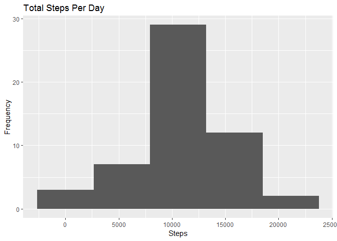
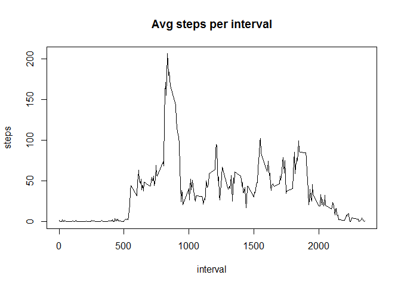
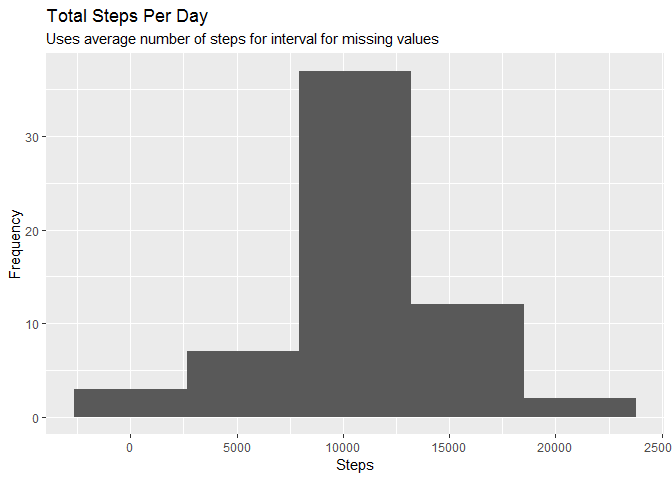
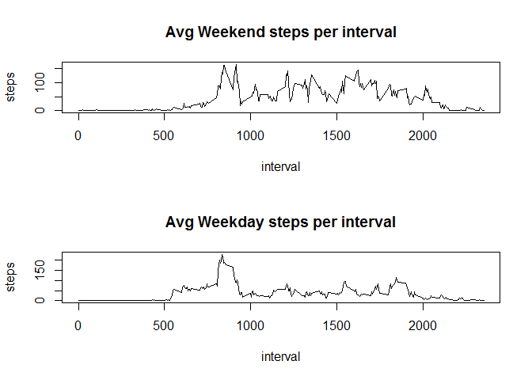

## Packages

```r
library(readr)
library(ggplot2)
library(dplyr)
library(chron)
```


## Loading and preprocessing the data


```r
unzip("activity.zip")
activity <- read_csv("activity.csv", col_types = cols(date = col_date(format = "%Y-%m-%d"), 
    steps = col_integer()))
```


## What is mean total number of steps taken per day?
1. Calculate Total Number of steps taken per day

```r
total<-aggregate(steps~date,activity, sum)
```
2.Histogram of total number of steps taken each day

```r
ggplot(total, aes(x=steps)) +geom_histogram(bins=5)+ labs(title="Total Steps Per Day", x="Steps", y="Frequency")
```

<!-- -->

3. Mean and Median number of steps taken per day  
-Mean

```r
mean(total$steps)
```

```
## [1] 10766.19
```
-Median

```r
median(total$steps)
```

```
## [1] 10765
```


## What is the average daily activity pattern?
1. Calculate Average number of steps taken per interval

```r
avgperint<-aggregate(steps~interval, activity, mean)
```
Create Time series plot

```r
plot(avgperint$interval, avgperint$steps,  type="l", main="Avg steps per interval", xlab="interval", ylab="steps")
```

<!-- -->

2. Interval with maximum number of steps
Arrange the intervals from greatest number of steps to least

```r
max<-arrange(avgperint, desc(avgperint$steps))
```

```
## Warning: package 'bindrcpp' was built under R version 3.4.4
```
The interval with the maximum number of steps

```r
max[1,1]
```

```
## [1] 835
```


## Imputing missing values  
1. Total number of missing values

```r
sum(is.na(activity$steps))
```

```
## [1] 2304
```
2. Fill in the missing values using the mean value for the interval

```r
merged<-merge(activity, avgperint, by="interval")
merged$stepsimputed=ifelse(is.na(merged$steps.x), merged$steps.y, merged$steps.x)
```
3. Create new data set

```r
imputed<-merged[, c(1, 3, 5)]
```
4. Create histogram of total steps per day  
-Calculate total steps per day

```r
imputedtotal<-aggregate(stepsimputed~date,imputed, sum)
```
-create histogram

```r
ggplot(imputedtotal, aes(x=stepsimputed)) +geom_histogram(bins=5)+ labs(title="Total Steps Per Day",subtitle="Uses average number of steps for interval for missing values", x="Steps", y="Frequency")
```

<!-- -->

-Mean number of steps per day

```r
mean(imputedtotal$steps)
```

```
## [1] 10766.19
```
-Median number of steps per day

```r
median(imputedtotal$steps)
```

```
## [1] 10766.19
```
The mean is the same whether we impute missing values or not.  
The median is slightly higher.  

## Are there differences in activity patterns between weekdays and weekends?  
1. Create factor variable for weekday or weekend.  

```r
first<-mutate(merged, weekend=is.weekend(merged$date)) 
second<-mutate(first, type=factor(weekend, levels=c("TRUE", "FALSE"), labels=c("weekend", "weekday")))
```
2. Make a panel plot of the 5 minute interval and avg number of steps take.  
-Calculate Average number of steps taken per interval per type of day

```r
impavgperint<-aggregate(stepsimputed~interval+type, second, mean)
```
-Create Time series plot

```r
weekend<-filter(impavgperint, type=="weekend")
weekday<-filter(impavgperint, type=="weekday")

par(mfrow=c(2,1))
plot(weekend$interval, weekend$steps,  type="l", main="Avg Weekend steps per interval", xlab="interval", ylab="steps")
plot(weekday$interval, weekday$steps,  type="l", main="Avg Weekday steps per interval", xlab="interval", ylab="steps")
```

<!-- -->


